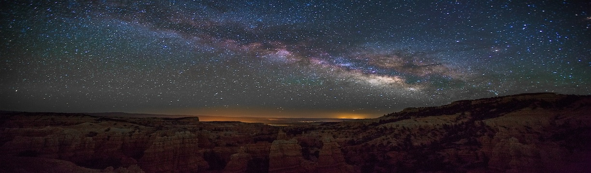

# Hi there! I'm Aastha Khatgarh 👋

I'm an **AI Enthusiast** and **Data Explorer** with a passion for solving complex problems using cutting-edge technologies like **Machine Learning** and **Natural Language Processing**. With a strong foundation in both backend and cloud services, I enjoy creating solutions that are **efficient**, **scalable**, and **impactful**. 

Currently, I am focused on building systems that automate processes, such as automating data extraction for the **Global Poverty Research Lab**, saving countless hours of manual work and accelerating research outcomes.

In addition to this, I am diving deeper into the world of **DevOps**, focusing on streamlining workflows and improving deployment efficiency using technologies like **AWS Lambda**, **Docker**, and **CI/CD Pipelines**.

- 💼 Interested in collaborating? Reach out to me via <a href="mailto:khatgarh.aastha@gmail.com">email.</a>
- 💬 Got a question or curious about AI and Machine Learning? Feel free to ask!

<code></code>
<code></code>
<code></code>
<code></code>

## 🌟 Featured Projects

### **[GPRL Data Entry Automation](https://github.com/NU-MSAI-Practicum/data_entry)(#)** 📝:  
**Technologies:** Python, GPT-4, Llama 3, AWS Lambda, S3, Docker, MongoDB, GitHub Actions

- Automated data extraction from research publications, reducing manual processing times by 60%.
- Implemented **Live Service** for real-time data processing and **Batch Processing** using **AWS Lambda** for high scalability and efficiency.
- Integrated **CI/CD pipelines** with **GitHub Actions** for seamless deployment, reducing downtime and ensuring the latest changes are automatically reflected.

---

### **[RedditModHelper](#)**(https://github.com/khatgarhaastha/RedditModHelper) 📝:  
**Technologies:** Python, Streamlit, PRAW, Milvus, Ollama

- Developed AI powered Moderator Dashboard to Detect Community Guideline violations in Subreddit Posts using Streamlit frontend and Ollama backend.
- Cut post analysis time by over 60\%, eliminating manual content parsing and boosting moderation efficiency.
- Automated rule violation flagging, enabling continuous subreddit monitoring and faster moderator responses.

---

### **[mPLUG Implementation for Cross-Modal Image and Text Understanding](#)**(https://github.com/khatgarhaastha/Image_captioning) 📝:  
**Technologies:** PyTorch, BERT-base, ResNet, and Vision Transformer (ViT)

- Developed and implemented mPLUG model integrating Cross-Modal Attention to enhance text embeddings using image embeddings.
- Compared performance across Transformer (ResNet + BERT) and Vision Transformer (ViT) base models, achieving a 27% performance improvement with mPLUG.
- Utilized PyTorch, BERT-base, ResNet, and Vision Transformer (ViT) for cross-modal understanding and attention mechanism design.

---

### **[Yelp Vision Classifier](https://github.com/khatgarhaastha/Yelp_Vision_Classifier)**(https://github.com/khatgarhaastha/Yelp_image_classifier) 📸:  
**Technologies:** PyTorch, CNN, VGG16, ResNet18

- Built an image classification model using **PyTorch**, achieving a 92% test accuracy on Yelp's image dataset.

---

### **[Sentiment Analysis with BERT](https://github.com/khatgarhaastha/Sentiment_analysis_using_BERT)**(https://github.com/khatgarhaastha/Sentiment_analysis_using_BERT) 💬:  
**Technologies:** PyTorch, BERT, NLP

- Created a sentiment analysis pipeline with **BERT**, processing airline reviews with over 90% precision and recall.

---

## 🌸 More About Myself

I’m someone who’s always eager to learn and grow, both personally and professionally. I enjoy the challenge of learning new technologies and applying them in innovative ways to solve real-world problems. When I'm not immersed in the world of AI and data, you can find me spending time on my hobbies—**painting** and **reading**—which allow me to unwind and spark my creativity.  

- 🎯 **Driven by impact**: I aim to use AI to make a real difference in the world, whether by helping to streamline research for poverty alleviation or building smart systems that improve lives.
  
- 🌍 **Passion for exploring**: I love traveling and understanding different cultures, and I'm always on the lookout for new perspectives and experiences.

- 📚 **Lifelong learner**: Whether it’s reading up on the latest tech trends or learning a new skill, I’m always hungry for knowledge. I believe there’s always something new to learn!

---

### 📬 Let’s Connect!
  

---

👩‍💻 Thanks for stopping by! Let’s build something amazing together! 💡

---

